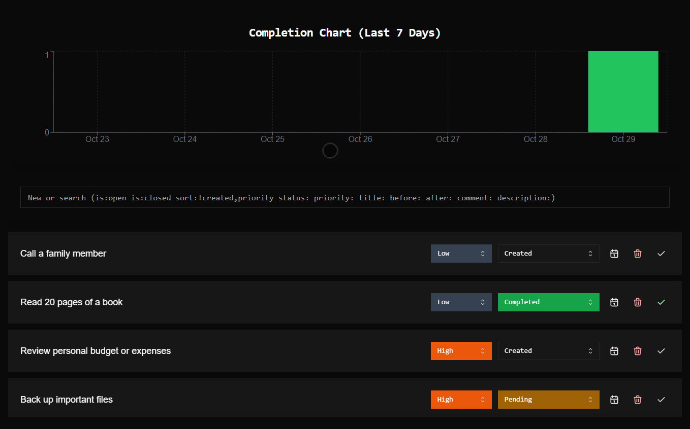

# Todos

A little experiment testing how practical a command-bar driven application would be.

## Demo

## Command bar syntax

There's 4 main functions for the command bar:

* Create a new TODO - just type whatever you want
* Filter todos - use the <attribute>:<value> syntax
* Sort todos - sort:<attribute 1> <attribute 2> ...
* Execute actions on selected todos - append a '> <attribute>:<value>' to an existing query

Some extra sugars:
* Dates can either be filtered by 'before', _during_, or 'after'. If you want all todos \
  that are needed by today, the query would be `needby:today`,  if you want everything that's due after today the \
  query is `needby:after today`, if you want every todo created pre-December `created:before december`
* Dates use a natural-language processor. So values like 'tomorrow' and 'next week' are fair game.
* Comments can be added by `> comment:a comment`.
* 'null' can be used on filters to check if an attribute is unset. 
  * To find todos with no comments: `comment:null`
  * To find todos with no need by date `needby:null`
* '!' can be used to invert any filter or sort. All comments with a need by date: `needby:!null`
* is:open/is:closed are easy shortcuts but do not represent real attributes, the real query would be `status:!resolved`
* Any string can be quoted if there's errors with the parsing.

Attributes:
* created - DATE
* updated - DATE
* completed - DATE
* needby - DATE
* id - NUMBER
* title - STRING
* description - STRING
* status - ENUM "created" | "pending" | "wip" | "blocked" | "completed"
* priority - ENUM "low" | "medium" | "high" | "critical"
* blockedby - WIP
* comment - STRING
* is - ENUM "open" | "closed" (derived attribute)
